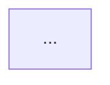

# Mermaid Adaptive Rendering Spec
- Version: 1.0
- Date: 2026-01-27

---

## 1. 대상 범위
### 자동 방향 전환 적용(✅)
- `graph`
- `flowchart`

### 자동 방향 전환 제외(❌)
- sequenceDiagram, gantt, classDiagram, stateDiagram, erDiagram, pie, journey, mindmap, timeline 등

---

## 2. Direction Lock
### 2.1 Front-matter 옵션(권장)
```yaml
---
mermaidDirectionLock: true
---
```

### 2.2 Mermaid 주석 옵션(대체)


---

## 3. 휴리스틱 (MVP)
### 3.1 화면 조건
- Portrait == true
- viewportWidthDp < 420

### 3.2 선언 조건
- 첫 라인의 선언이 아래 중 하나일 때만
  - `graph LR` / `graph RL`
  - `flowchart LR` / `flowchart RL`

### 3.3 복잡도 조건(OR)
- edgeCount(`-->`) >= 6
- 평균 라벨 길이 >= 12
- 코드 길이 >= 300 chars

### 3.4 변환 규칙
- `graph LR|RL` → `graph TB`
- `flowchart LR|RL` → `flowchart TB`
- 오직 첫 선언 라인만 치환
- subgraph 내부는 미변경

---

## 4. Fallback
- 변환 후 렌더 에러 → 원본 코드로 재시도 → 실패 시 원본 코드 표시 + 오류 메시지

---

## 5. 확대(Focus View) 정책
- 본문: fit-to-width
- 탭: Focus View
- Focus View: pinch zoom + pan
